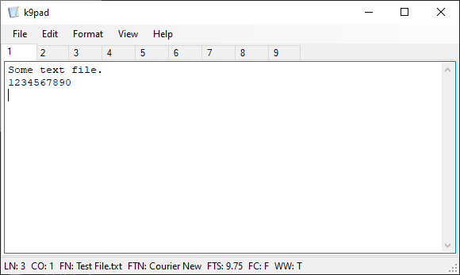

# k9pad

k9pad is a Windows notepad clone. You have pretty much same options, except that this clone has 9 tabs. 
There is no need to describe the usage as it is the same as any other plain text editor. 

At the bottom, there are 7 indicators.

* LN - Shows the line number
* CO - Show the column number
* FN - Shows the file name when you save the document
* FTN - Font name
* FTS - Font size
* FC - File changed (*T*rue or *F*alse)
* WW - Word wrap (*T*rue or *F*alse)

You can build the program using Visual Studio and .NET 4.5 or use the binary from the releases.